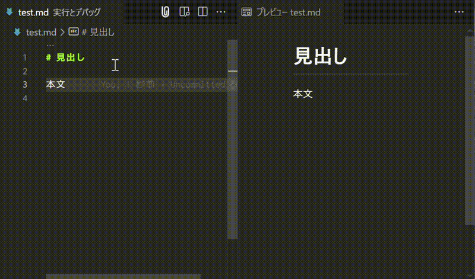

# Markdown Clip


MarkdownをHTMLに変換し、クリップボードにコピーする機能を提供する Visual Studio Code 拡張機能です。


<!-- omit in toc -->
## 目次
- [インストール](#インストール)
- [使用例](#使用例)
- [機能](#機能)
- [使用方法](#使用方法)
- [解説](#解説)
- [設定オプション](#設定オプション)
- [クレジット](#クレジット)
- [使用しているプラグイン](#使用しているプラグイン)
- [謝辞](#謝辞)


## インストール
Visual Studio Code のマーケットプレイスで「Markdown Clip」と入力してください｡

<p align="center">

</p>


## 使用例
ファイル全体のMarkdownテキストをHTMLに変換し、クリップボードに自動コピーします。




## 機能
- 選択した Markdownテキスト を HTML に変換
- 選択範囲がない場合は、Markdownファイル 全体を変換
- 変換したHTMLをクリップボードに自動貼り付け


## 使用方法
| コマンド                                                   | キーボード                                        | アイコン                                      | 
| ---------------------------------------------------------- | ------------------------------------------------- | --------------------------------------------- | 
| HTML に変換してクリップボードに貼り付ける | <kbd>CTRL</kbd> + <kbd>Shift</kbd> + <kbd>c</kbd> | <p align="center"></p> | 


## 解説
「Markdown Clip」は、MarkdownをHTMLに変換し、クリップボードに貼り付ける Visudal Studio Code 拡張機能です。


1. Markdownファイルを開く
2. 変換したい範囲を選択（任意）
3. 任意の方法でコマンドを実行
4. クリップボードにHTMLがコピーされます


```md
// Markdown の文章
**文字** 
```
```html
// HTML に変換されてクリップボードに貼り付けられる
<strong>文字</strong>
```


## 設定オプション

### Reomove Heading ID
- true: 自動生成される見出しID（`<h1 id='タイトル'>`）を無効
- false（**デフォルト**）: 見出しIDを保持

```md
// Markdown の文章（※markdown-it-attrs適用）
# テスト {#test}
```
```html
// 設定が true の場合
<h1 id="test">テスト</h1>

// 設定が false の場合
<h1 id="test" id="テスト-test">テスト</h1>
```

### Reomove VSCode Attributes
- true: 自動生成されるVSCodeの各属性（`<h1 data-line="数字", class="code-line", dir="auto">`）を無効
- false（**デフォルト**）: VSCodeの各属性を保持

```md
// Markdown の文章
# テスト
```
```html
// 設定が true の場合
<h1>テスト</h1>

// 設定が false の場合
<h1 data-line="0" class="code-line" dir="auto">テスト</h1>
```


### プラグイン設定
#### ON/OFF機能
- `Markdown-it-attrs: Enable`
  - true（デフォルト） : カスタム属性（{#id .class}形式）を指定すると、それをHTMLタグに適用します。
  - false : プラグインは無効になり、カスタムID（{#id}形式）が反映されなくなります。

```md
// Markdown の文章
# テスト {.test}
```
```html
// 設定が true の場合
<h1 class="test">テスト</h1>

// 設定が false の場合
<h1>テスト {.test}</h1>
```


#### 詳細設定
- `Markdown-it-attrs: Options`
  - settings.json で編集: 各プラグインの詳細設定を編集できます

以下がデフォルト設定です。
```json
{
    "leftDelimiter": "{",    // 開始区切り文字
    "rightDelimiter": "}",   // 終了区切り文字
    "allowedAttributes": []  // 許可する属性（表記無しは全て許可）
}
```


## クレジット
VScode拡張機能で表示されるアイコンは、以下の2つの画像を組み合わせたものです。


| 画像                                                                                                                                                                                          | ライセンス                                                      | 作者/サイト                                                                                                     | 
| --------------------------------------------------------------------------------------------------------------------------------------------------------------------------------------------- | --------------------------------------------------------------- | --------------------------------------------------------------------------------------------------------------- | 
| [Free Markdown Icon](https://iconscout.com/free-icon/markdown-1)                                                                                                                                  | [MIT ライセンス](https://opensource.org/license/MIT)            | [Benjamin J sperry](https://iconscout.com/contributors/benjamin-j-sperry) / [IconScout](https://iconscout.com/) | 
| [クリップのフリーアイコン素材](https://icooon-mono.com/00017-%E3%82%AF%E3%83%AA%E3%83%83%E3%83%97%E3%81%AE%E3%83%95%E3%83%AA%E3%83%BC%E3%82%A2%E3%82%A4%E3%82%B3%E3%83%B3%E7%B4%A0%E6%9D%90/) | [icooon-mono独自のライセンス](https://icooon-mono.com/license/) | [icooon-mono](https://icooon-mono.com/)                                                                         | 


## 使用しているプラグイン
- [copy-paste](https://www.npmjs.com/package/copy-paste)
- [markdown-it-attrs](https://www.npmjs.com/package/markdown-it-attrs)


## 謝辞

このプロジェクトの開発にあたり、以下のオープンソースソフトウェアを参考にさせていただきました。この場を借りて感謝の意を表します。

- [qjebbs/vscode-markdown-extended](https://github.com/qjebbs/vscode-markdown-extended)

追加のライセンス情報については、[NOTICE](https://github.com/yusu79/vscode-markdown-clip/blob/main/NOTICE)ファイルをご覧ください。
