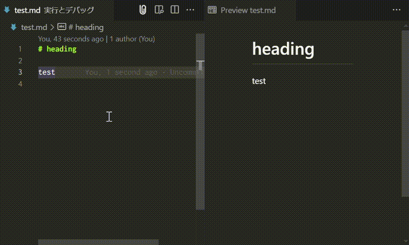

# Markdown Clip


[日本語版の「README」はこちらから](https://github.com/yusu79/vscode-markdown-clip/blob/main/README.ja.md)


A Visual Studio Code extension that provides functionality to convert Markdown to HTML and copy it to the clipboard.


<!-- omit in toc -->
## TOC
- [Installation](#installation)
- [Example](#example)
- [Features](#features)
- [Usage](#usage)
- [Explanation](#explanation)
- [Settings](#settings)
- [Credits](#credits)
- [Used Plugins](#used-plugins)
- [Acknowledgments](#acknowledgments)

## Installation
Enter "Markdown Clip" in the VS Code marketplace.

<p align="center">

</p>

## Example
Converts the entire Markdown text of a file to HTML and automatically copies it to the clipboard.



## Features
- Convert selected Markdown text to HTML
- If no range is selected, convert the entire Markdown file
- Automatically paste the converted HTML to the clipboard

## Usage

| Command                                                  | Keyboard Shortcut                        | Icon                                         |
|----------------------------------------------------------|------------------------------------------|----------------------------------------------|
| Convert to HTML and Copy to clipboard                 | <kbd>CTRL</kbd> + <kbd>Shift</kbd> + <kbd>c</kbd> |  |

## Explanation
"Markdown Clip" is a VS Code extension that converts Markdown to HTML and copies it to the clipboard.

1. Open a Markdown file
2. Select the range you want to convert (optional)
3. Execute the command using any method
4. HTML is copied to the clipboard

```md
// Markdown Text
**Text**
```
```html
// HTML converted and pasted to clipboard
<strong>Text</strong>
```

## Settings

### Remove Heading ID
- `true` (Default): Disables automatically generated heading IDs (`<h1 id='Title'>`)
- `false`: Keep heading IDs

```md
// Markdown Text (with markdown-it-attrs applied)
# Test {#test}
```
```html
// If setting is true
<h1 id="test">Test</h1>

// If setting is false
<h1 id="test" id="Test-test">Test</h1>
```

### Remove VSCode Attributes
- `true`: Disables automatically generated VSCode attributes (`<h1 data-line="number", class="code-line", dir="auto">`)
- `false` (Default): Keep VSCode attributes

```md
// Markdown Text
# Test
```
```html
// If setting is true
<h1>Test</h1>

// If setting is false
<h1 data-line="0" class="code-line" dir="auto">Test</h1>
```

### Plugin Settings

#### ON/OFF Function
- `Markdown-it-attrs: Enable`
    - `true` (Default): When custom attributes (`{#id .class}` format) are specified, apply them to the HTML tag.
    - `false`: The plugin is disabled, and custom IDs (`{#id}` format) are no longer reflected.

```md
// Markdown Text
# Test {.test}
```
```html
// If setting is true
<h1 class="test">Test</h1>

// If setting is false
<h1>Test {.test}</h1>
```

#### Detailed Settings
- `Markdown-it-attrs: Options`
    - `Edit in settings.json`: You can edit the detailed settings for each plugin.

The following is the default setting:
```json
{
    "leftDelimiter": "{",    // Opening delimiter
    "rightDelimiter": "}",   // Closing delimiter
    "allowedAttributes": []  // Allowed attributes (No notation means all are allowed)
}
```

## Credits
The icon displayed in the VS Code extension is a combination of the following two images:

| Image                                                                                                                                                                                            | License                                                        | Author/Site                                                                                                      |
|---------------------------------------------------------------------------------------------------------------------------------------------------------------------------------------------------|-----------------------------------------------------------------|------------------------------------------------------------------------------------------------------------------|
| [Free Markdown Icon](https://iconscout.com/free-icon/markdown-1)                                                                                                                                   | [MIT License](https://opensource.org/license/MIT)             | [Benjamin J sperry](https://iconscout.com/contributors/benjamin-j-sperry) / [IconScout](https://iconscout.com/)  |
| [Clip Free Icon Material](https://icooon-mono.com/00017-%E3%82%AF%E3%83%AA%E3%83%83%E3%83%97%E3%81%AE%E3%83%95%E3%83%AA%E3%83%BC%E3%82%A2%E3%82%A4%E3%82%B3%E3%83%B3%E7%B4%A0%E6%9D%90/) | [icooon-mono License](https://icooon-mono.com/license/) | [icooon-mono](https://icooon-mono.com/)                                                                          |

## Used Plugins
- [copy-paste](https://www.npmjs.com/package/copy-paste)
- [markdown-it-attrs](https://www.npmjs.com/package/markdown-it-attrs)

## Acknowledgments

In developing this project, we referenced the following open-source software. We would like to express our gratitude:

- [qjebbs/vscode-markdown-extended](https://github.com/qjebbs/vscode-markdown-extended)

For additional licensing information, please see the [NOTICE](https://github.com/yusu79/vscode-markdown-clip/blob/main/NOTICE) file.

